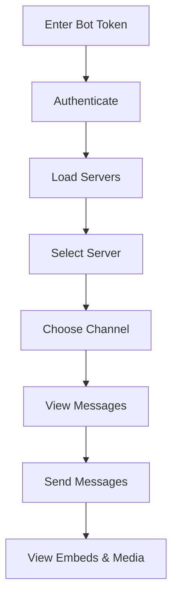

<div align="center">

<!-- =====================  HERO  ===================== -->

<picture>
  <source media="(prefers-color-scheme: dark)" srcset="https://readme-typing-svg.herokuapp.com?font=Inter&weight=800&size=64&duration=3000&pause=1000&color=1E3A8A&background=00000000&center=true&vCenter=true&width=600&height=100&lines=BotClienty;Discord+Bot+Client;Modern+Web+Interface">
  
</picture>

<h3 align="center">🤖 Modern Web Client for Discord Bots</h3>

<p align="center">
  
  
  
  
</p>

<p align="center">
  
  
  
</p>

<p align="center">
  <em>Connect with your bot token, navigate servers/channels, view messages (embeds & attachments) and send messages in a clean UI inspired by Discord.</em>
</p>

<p align="center">
  <a href="#-features">Features</a> •
  <a href="#-quick-start">Quick Start</a> •
  <a href="#-usage-guide">Usage</a> •
  <a href="#-tech-stack">Tech Stack</a> •
  <a href="#-contributing">Contributing</a>
</p>

</div>

---

## ✨ Features

<div align="center">

<table>
  <tr>
    <td align="center" width="33%">
      
      <br/>
      <b>🔐 Secure Authentication</b><br/>
      <sub>Connect with bot token without third-party data sharing</sub>
    </td>
    <td align="center" width="33%">
      
      <br/>
      <b>⚡ Real-time Updates</b><br/>
      <sub>Messages and sending with instant updates</sub>
    </td>
    <td align="center" width="33%">
      
      <br/>
      <b>🎨 Discord-inspired UI</b><br/>
      <sub>Dark, responsive and modern layout</sub>
    </td>
  </tr>
</table>

</div>

### 🌟 Core Capabilities

<div align="center">

| Feature | Description | Status |
|---------|-------------|--------|
| 🔐 **Token Authentication** | Securely connect to your bot | ✅ Ready |
| 📱 **Responsive Layout** | Desktop / Tablet / Mobile support | ✅ Ready |
| 🎨 **Modern Dark Theme** | Refined dark visual experience | ✅ Ready |
| ⚡ **Real-time Updates** | View and send messages instantly | ✅ Ready |
| 🖼️ **Rich Content Support** | Embeds, attachments and media | ✅ Ready |
| 🚀 **Next.js Performance** | Optimized build and static export | ✅ Ready |
| 📁 **File Upload** | Send images, documents and media | 🆕 New |
| 🔍 **Message Search** | Search through channel messages | 🆕 New |
| ⚡ **Message Pagination** | Load more historical messages | 🆕 New |
| 👤 **User Profiles** | View detailed user information | 🆕 New |
| ⚙️ **Server Settings** | View guild information and settings | 🆕 New |
| 😊 **Message Reactions** | Add and view emoji reactions | 🆕 New |
| 📊 **Enhanced Loading** | Better error handling and loading states | 🆕 New |

---

## 🎬 Preview

<div align="center">

### 🔑 Authentication Screen
> Clean and straightforward bot token authentication


### 💬 Chat Interface
> Navigate guild tree, view embeds and attachments in real-time


### 📱 Responsive Design
> Adaptive UI with consistent typography and spacing


</div>

---

## 🚀 Quick Start

<div align="center">

### Prerequisites


</div>

```bash
# Check your versions
node --version  # 18.x or higher
npm --version   # 8.x or higher
```

### Installation & Setup

```bash
# 1️⃣ Clone the repository
git clone https://github.com/amathyzinn/botclienty.git
cd botclienty

# 2️⃣ Install dependencies
npm install

# 3️⃣ Start development server
npm run dev

# 4️⃣ Open in browser
# http://localhost:3000
```

### 🏗️ Production Build

```bash
# Build for production
npm run build

# Artifacts in ./out ready for static hosting
npm run export
```

---

## 🚀 Deployment on Render

<div align="center">

### Prerequisites


</div>

### Quick Deploy to Render

[](https://render.com/deploy)

1. **Connect your repository** to Render
2. **Use the provided `render.yaml`** configuration
3. **Environment variables** (if needed):
   - `NODE_VERSION`: `18.17.0`
   - `NPM_FLAGS`: `--production=false`
4. **Deploy** - Render will automatically build and deploy

### Manual Deployment Steps

1. **Create a new Web Service** on [Render Dashboard](https://dashboard.render.com)
2. **Connect your Git repository** (GitHub, GitLab, or Bitbucket)
3. **Configure build settings**:
   - **Build Command**: `npm install && npm run build`
   - **Start Command**: `npm start`
   - **Node Version**: `18.17.0`
4. **Deploy** and wait for the build to complete

### Environment Configuration

```bash
# Environment variables (optional)
NODE_VERSION=18.17.0
NPM_FLAGS=--production=false
```

### Deployment Features

| Feature | Status | Description |
|---------|--------|-------------|
| 🔄 **Auto Deploy** | ✅ Ready | Push to deploy with Git |
| 🌐 **Custom Domain** | ✅ Ready | Add your own domain |
| 🔒 **HTTPS** | ✅ Ready | SSL certificate included |
| 📊 **Analytics** | ✅ Ready | Built-in performance monitoring |
| 🔧 **Environment Variables** | ✅ Ready | Secure configuration management |

---

---

## 📖 Usage Guide

<div align="center">

### Getting Your Bot Token

</div>

1. Visit the [Discord Developer Portal](https://discord.com/developers/applications)
2. Create a new application or select an existing one
3. Navigate to the **Bot** section
4. Generate or copy your bot token
5. **⚠️ Never share your token publicly**

### Application Flow



<div align="center">

### 🔒 Security Best Practices

| ✅ Do | ❌ Don't |
|-------|----------|
| Store tokens locally only | Share tokens publicly |
| Use environment variables | Commit tokens to git |
| Regenerate if compromised | Use tokens in client-side code |
| Follow Discord ToS | Abuse rate limits |

</div>

---

## 🛠️ Tech Stack

<div align="center">

<table>
  <tr>
    <td align="center">
      
      <br><sub>React Framework</sub>
    </td>
    <td align="center">
      
      <br><sub>UI Library</sub>
    </td>
    <td align="center">
      
      <br><sub>Type Safety</sub>
    </td>
    <td align="center">
      
      <br><sub>Bot Integration</sub>
    </td>
  </tr>
</table>

</div>

### Architecture Overview

```
Frontend (Next.js + React + TypeScript)
    ↓
Discord API Integration
    ↓
Real-time Message Handling
    ↓
Responsive UI Components
```

---

## 📁 Project Structure

```
botclienty/
├── 📁 app/                 # Next.js App Router
│   ├── 🎨 globals.css      # Global styles & theme
│   ├── 📄 layout.tsx       # Root layout component
│   ├── 🏠 page.tsx         # Main page component
│   └── 📁 api/             # API routes
│       └── 📁 discord/     # Discord API integration
├── 📁 public/              # Static assets
│   └── 🖼️ logo.webp        # Application logo
├── ⚙️ next.config.js       # Next.js configuration
├── 📦 package.json         # Dependencies & scripts
├── 🔧 tsconfig.json        # TypeScript configuration
└── 📖 README.md            # This file
```

---

## 🎨 Design System

<div align="center">

### 🎭 Color Palette

</div>

```css
/* Dark Blue Theme */
:root {
  --primary-bg: #0F172A;      /* Main background */
  --secondary-bg: #1E293B;    /* Cards/panels */
  --accent-blue: #1E3A8A;     /* Primary accent */
  --accent-light: #3B82F6;    /* Light blue accent */
  --accent-dark: #1E40AF;     /* Dark blue accent */
  --text-primary: #F8FAFC;    /* Primary text */
  --text-secondary: #CBD5E1;  /* Secondary text */
  --hover-bg: #334155;        /* Hover states */
  --border-color: #475569;    /* Borders */
  --success-color: #10B981;   /* Success states */
  --error-color: #EF4444;     /* Error states */
  --warning-color: #F59E0B;   /* Warning states */
}
```

### 🔤 Typography Scale

```css
/* Inter Font Family */
font-family: 'Inter', system-ui, -apple-system, BlinkMacSystemFont, 'Segoe UI', sans-serif;

/* Type Scale */
--text-xs: 0.75rem;    /* 12px - Small labels */
--text-sm: 0.875rem;   /* 14px - Body small */
--text-base: 1rem;     /* 16px - Body */
--text-lg: 1.125rem;   /* 18px - Large body */
--text-xl: 1.25rem;    /* 20px - Small headings */
--text-2xl: 1.5rem;    /* 24px - Medium headings */
--text-3xl: 1.875rem;  /* 30px - Large headings */
--text-4xl: 2.25rem;   /* 36px - Extra large */
```

---

## 🔒 Security & Privacy

<div align="center">

| Security Feature | Implementation |
|------------------|----------------|
| 🔐 **Local Token Storage** | Tokens stored locally, no third-party sharing |
| 🌐 **HTTPS Only** | All API calls use secure HTTPS connections |
| 🚫 **No Data Collection** | No external data collection or analytics |
| 💾 **Client-side Only** | All data remains on your device |
| 🔄 **Token Rotation** | Support for easy token regeneration |

</div>

### Privacy Commitment

- ✅ **No tracking** - We don't track your usage
- ✅ **No analytics** - No third-party analytics services
- ✅ **No data sharing** - Your bot data stays with you
- ✅ **Open source** - Full transparency in our code

---

## 🧩 Customization

### Theme Customization

```tsx
// theme.config.ts
export const customTheme = {
  colors: {
    primary: '#1E3A8A',
    secondary: '#3B82F6',
    background: '#0F172A',
    surface: '#1E293B',
  },
  borderRadius: {
    sm: '0.375rem',
    md: '0.5rem',
    lg: '0.75rem',
    xl: '1rem',
  },
  spacing: {
    xs: '0.25rem',
    sm: '0.5rem',
    md: '1rem',
    lg: '1.5rem',
    xl: '2rem',
  },
};
```

### Component Customization

```tsx
// components/CustomCard.tsx
export function CustomCard({ children }: { children: React.ReactNode }) {
  return (
    <div className="bg-secondary-bg rounded-lg p-4 border border-border-color shadow-lg hover:shadow-xl transition-shadow">
      {children}
    </div>
  );
}
```

---

## 🤝 Contributing

<div align="center">

We welcome contributions! Here's how you can help:


</div>

### Development Workflow

```bash
# 1️⃣ Fork the repository
# 2️⃣ Create a feature branch
git checkout -b feature/your-feature-name

# 3️⃣ Make your changes
# 4️⃣ Write descriptive commits
git commit -m "feat: add your feature description"

# 5️⃣ Push and create a Pull Request
git push origin feature/your-feature-name
```

### Contribution Guidelines

- 📝 **Clear descriptions** - Explain what and why
- 🧪 **Test your changes** - Ensure everything works
- 📚 **Update documentation** - Keep docs current
- 🎨 **Follow code style** - Maintain consistency
- 🔍 **Review process** - Be open to feedback

---

## 📊 Project Stats

<div align="center">


</div>

---

## 📄 License

<div align="center">


This project is licensed under the MIT License - see the [LICENSE](./LICENSE) file for details.

</div>

---

## 🌟 Support

<div align="center">

<h3>⭐ Star this project if you find it helpful!</h3>

<p>
  <a href="https://github.com/aMathyzinn">
    
  </a>
  <a href="https://amathyzin.com.br">
    
  </a>
  <a href="https://amathyzin.xyz">
    
  </a>
  <a href="https://discord.gg/XXquEjp69D">
    
  </a>
</p>

<p><sub>Made with ❤️ for the Discord community — by <b>aMathyzin</b></sub></p>

<p><a href="#-features">⬆️ Back to top</a></p>

</div>

---

<div align="center">

### 🚀 Ready to get started?

<a href="#-quick-start">
  
</a>

</div>
